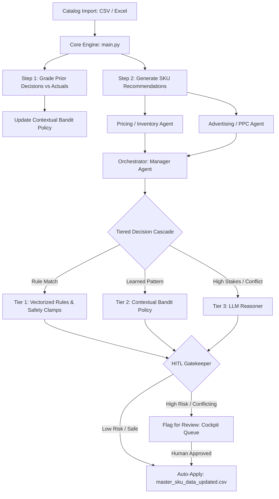

# 📦 Autonomous Multi-Agent Amazon Catalog Copilot

[](https://www.python.org/)
[](LICENSE)
[](app.py)
[](config.py)
[](CODEBASE_TECHNICAL_REPORT.md)

> **An enterprise-grade, closed-loop multi-agent P&L owner system designed to dynamically optimize pricing, inventory health, and PPC advertising bids across large-scale Amazon seller catalogs.**

---

## 🌟 Overview

Managing complex Amazon retail catalogs requires balancing interdependent variables: price elasticity, Buy Box win rates, margin floors, inventory Days of Supply (DOS), and Advertising Cost of Sales (ACOS). Manual adjustment does not scale, while naïve single-objective algorithms trigger stockouts or ad-spend waste.

The **Amazon Catalog Copilot** solves this by operating a **closed-loop multi-agent P&L engine** with a **3-Tier Decision Cascade** and **Human-in-the-Loop (HITL)** risk controls.

```
       ┌────────────────────────────────────────────────────────┐
       │             Catalog Ingestion (CSV / XLSX)             │
       └───────────────────────────┬────────────────────────────┘
                                   │
                    ┌──────────────┴──────────────┐
                    ▼                             ▼
       ┌────────────────────────┐    ┌────────────────────────┐
       │ Pricing & Inventory    │    │  Advertising / PPC     │
       │       Subagent         │    │       Subagent         │
       └────────────┬───────────┘    └────────────┬───────────┘
                    │                             │
                    └──────────────┬──────────────┘
                                   ▼
       ┌────────────────────────────────────────────────────────┐
       │       Manager Orchestrator Agent (P&L Owner)          │
       │ ┌────────────────────────────────────────────────────┐ │
       │ │ Tier 1: Deterministic Rules & Margin Clamps        │ │
       │ │ Tier 2: Learned Contextual Bandit Policy (Q-table) │ │
       │ │ Tier 3: LLM Reasoning Cascade (GPT-4o / Claude)   │ │
       │ └────────────────────────────────────────────────────┘ │
       └───────────────────────────┬────────────────────────────┘
                                   │
                    ┌──────────────┴──────────────┐
                    ▼                             ▼
       ┌────────────────────────┐    ┌────────────────────────┐
       │ Low Risk (Auto-Apply)  │    │ High Risk (HITL Flag)  │
       │ Updated Master CSV     │    │ Approval Queue Dashboard│
       └────────────────────────┘    └────────────────────────┘
```

---

## ✨ Key Features

- 🤖 **Autonomous Multi-Agent Architecture**: Dedicated specialized subagents analyze Pricing/Inventory dynamics and Advertising performance, reporting to a central Manager Orchestrator.
- ⚡ **Hierarchical 3-Tier Decision Cascade**:
  - **Tier 1 (Deterministic Safety Clamps)**: Hard-coded guardrails protecting profit margin floors, preventing stockouts, and clamping extreme price jumps.
  - **Tier 2 (Learned Contextual Bandit)**: Reinforced policy memory table that learns action rewards over sequential runs and vetoes historically underperforming strategies.
  - **Tier 3 (LLM Reasoning Cascade)**: Deep-reasoning fallback powered by state-of-the-art LLMs (via OpenRouter) for complex, conflicting, or edge-case catalog states.
- 🔄 **Closed-Loop Offline Reinforcement Learning**: Evaluates previous decisions against actual incoming sales data to calculate reward deltas and update contextual Q-value estimates.
- 🛡️ **Human-In-The-Loop (HITL) Gatekeeper**: Automatically routes high-stake or low-confidence decisions to a review queue for human executive approval.
- 🖥️ **Dual Control Cockpits**:
  - **Streamlit Control Center ([app.py](file:///c:/Users/verel/Downloads/Amazon%20Agg/app.py))**: Full dashboard with narrative control, baseline metrics comparison, ledger auditability, and chatbot.
  - **Native Custom SaaS Cockpit ([server.py](file:///c:/Users/verel/Downloads/Amazon%20Agg/server.py))**: Lightweight HTML5/CSS3 single-page web app running on port 8000.
- 💬 **Conversational AI Manager ([chatbot.py](file:///c:/Users/verel/Downloads/Amazon%20Agg/agents/chatbot.py))**: Natural language assistant capable of explaining SKU-level decisions, searching catalog history, and executing user commands.

---

## 🏗️ System Architecture

### 1. Decision Flow



### 2. Subagent Responsibilities

| Subagent | File | Core Analysis & Functions |
|---|---|---|
| **Pricing & Inventory** | [`agents/inventory.py`](file:///c:/Users/verel/Downloads/Amazon%20Agg/agents/inventory.py) | Evaluates profit margin headroom, Days of Supply (DOS), stockout risk, competitor pricing, and Buy Box ownership. Emits actions: `RAISE_PRICE`, `DROP_PRICE`, `HOLD_PRICE`, `RAISE_SLIGHTLY`. |
| **Advertising / PPC** | [`agents/advertising.py`](file:///c:/Users/verel/Downloads/Amazon%20Agg/agents/advertising.py) | Analyzes ACOS vs Target ACOS, Click-Through Rates (CTR), Total ACOS (TACOS), conversion rates, and organic sales ratio. Emits actions: `INCREASE_BIDS`, `LOWER_BIDS`, `PAUSE_CAMPAIGN`, `MAINTAIN_BIDS`. |
| **Manager Orchestrator** | [`agents/manager.py`](file:///c:/Users/verel/Downloads/Amazon%20Agg/agents/manager.py) | Acts as the central P&L owner. Resolves subagent conflicts, runs the 3-tier cascade, applies learned policy vetoes, invokes LLMs for edge cases, and assigns human review flags. |
| **Conversational Assistant** | [`agents/chatbot.py`](file:///c:/Users/verel/Downloads/Amazon%20Agg/agents/chatbot.py) | Provides natural language interactive explainability, letting users query why specific SKU decisions were made and inspect system memory. |

---

## 🎯 The 3-Tier Decision Cascade

The orchestrator avoids unnecessary LLM compute costs while maintaining safety using a 3-tier execution flow:

```
+-----------------------------------------------------------------------+
| TIER 1: DETERMINISTIC RULES & CLAMPS (Safe Bounds)                     |
| - Hard Margin Floor: Block price cuts if margin < threshold           |
| - Stockout Clamp: Force price increase or ad pause if DOS < 14 days    |
| - Max Price Adjustment Guard: Limit per-run price moves (e.g. ±15%)    |
+-----------------------------------------------------------------------+
                                  │ (If unhandled / complex)
                                  ▼
+-----------------------------------------------------------------------+
| TIER 2: LEARNED CONTEXTUAL BANDIT POLICY (RL Memory)                   |
| - Matches context state: (Category x Supply State x Buy Box State)    |
| - Consults Q-value table in manager_memory.json                       |
| - Vetoes actions with negative historical reward deltas               |
+-----------------------------------------------------------------------+
                                  │ (If conflicting / high-stakes)
                                  ▼
+-----------------------------------------------------------------------+
| TIER 3: LLM REASONING CASCADE (OpenAI / OpenRouter)                    |
| - Multi-step prompt with SKU context, subagent intents & guardrails    |
| - Structured JSON output parsing with fallback safety                  |
+-----------------------------------------------------------------------+
```

---

## 📁 Repository Structure

```gantt
Amazon Agg/
├── agents/                       # Specialized subagent modules
│   ├── advertising.py            # Advertising & PPC optimization subagent
│   ├── base.py                   # Base HybridAgent template method
│   ├── chatbot.py                # Conversational manager interface agent
│   ├── inventory.py              # Pricing & Inventory health subagent
│   ├── manager.py                # Manager Orchestrator & P&L owner logic
│   └── registry.py               # Extensible subagent registry
├── models/                       # Data structures & domain schemas
│   ├── business.py               # Business objectives & constraints models
│   ├── context.py                # Shared context dataclass definition
│   ├── enums.py                  # Action & state enumeration types
│   ├── recommendations.py        # Recommendation data structures
│   └── results.py                # Simulation result structures
├── simulator/                    # Market simulation environment
│   └── market.py                 # Single-SKU market event simulator
├── utils/                        # Memory, RL policy, parsing & LLM transport
│   ├── llm.py                    # OpenRouter / OpenAI API client wrapper
│   ├── memory.py                 # Contextual bandit memory & reward functions
│   └── parsing.py                # Markdown JSON extraction & validation
├── static/                       # Custom SaaS Cockpit frontend assets
│   ├── index.html                # Modern single-page app HTML layout
│   ├── style.css                 # Custom CSS styling (Linear/Vercel design)
│   └── app.js                    # Reactive client-side JS logic
├── app.py                        # Streamlit HITL Dashboard application
├── server.py                     # Standalone Python HTTP web server (Port 8000)
├── run_ui.py                     # Launcher script for server.py
├── main.py                       # CLI Batch Manager execution engine
├── config.py                     # Global configuration & seed setup
├── requirements.txt              # Project dependencies
├── master_sku_data.xlsx          # Baseline SKU master data sheet
├── master_sku_data_updated.csv   # Auto-updated SKU data output
├── manager_decisions.csv         # Complete decision audit report output
├── manager_memory.json           # Persistent contextual bandit policy memory
├── technical_brief.md            # System technical architecture document
└── CODEBASE_TECHNICAL_REPORT.md  # Comprehensive code-level technical report
```

---

## 🚀 Quick Start

### 1. Prerequisites
- Python `3.9` or higher
- An OpenRouter API Key (or OpenAI API Key)

### 2. Installation

Clone the repository and install required Python packages:

```bash
# Clone the repository
git clone https://github.com/your-org/amazon-catalog-copilot.git
cd amazon-catalog-copilot

# Create and activate virtual environment
python -m venv venv
# On Windows:
venv\Scripts\activate
# On macOS/Linux:
source venv/bin/activate

# Install dependencies
pip install -r requirements.txt
```

### 3. Environment Configuration

Create a `.env` file in the root directory:

```env
OPENROUTER_API_KEY=your_openrouter_api_key_here
# Optional model overrides (Defaults: google/gemini-2.5-flash)
PRIMARY_MODEL=google/gemini-2.5-flash
REASONING_MODEL=anthropic/claude-3.5-sonnet
```

---

## 💻 Usage & Running Modes

### Mode 1: CLI Batch Engine (`main.py`)

Run the full autonomous batch pipeline over your SKU dataset. This grades the previous run's decisions, updates the contextual bandit RL memory, executes all agents, and writes outputs to disk.

```bash
# Run with default catalog (master_sku_data.xlsx)
python main.py

# Or run with a custom input CSV / XLSX file
python main.py path/to/your_catalog.csv
```

**Output Artifacts Generated:**
- `manager_decisions.csv`: Complete audit log of every SKU decision (Old Price ➔ New Price, Old Bids ➔ New Bids, Confidence, Rationale, HITL Flag status).
- `master_sku_data_updated.csv`: Updated SKU table with safe auto-applied changes.
- `manager_memory.json`: Updated contextual bandit Q-table and run metrics snapshot.

---

### Mode 2: Streamlit Interactive Dashboard (`app.py`)

Launch the rich Streamlit web cockpit featuring financial comparison ledgers, chart visualizers, approval queues, and conversational AI assistance.

```bash
streamlit run app.py
```

Open your browser to `http://localhost:8501`.

**Dashboard Features:**
- 📊 **Executive Overview**: Financial metrics, revenue delta, and active price/ad distribution.
- ⚖️ **Baseline Comparative Ledger**: Compare newly uploaded SKU sheets against original master baselines.
- 🛡️ **HITL Approval Queue**: One-click Approve / Reject buttons for flagged decisions.
- 🧠 **Policy Inspector**: Inspect real-time contextual bandit Q-value tables and state reward histories.
- 💬 **AI Copilot Assistant**: Embedded chat interface to query system decisions and request instant re-evaluations.

---

### Mode 3: Lightweight Custom SaaS Cockpit (`run_ui.py`)

Launch the standalone lightweight HTTP web server built with vanilla HTML/CSS/JS.

```bash
python run_ui.py
```

Access the native SaaS dashboard at `http://localhost:8000`.

---

## 📊 Data Schema & Memory Structure

### Input Dataset Format (`master_sku_data.xlsx` / CSV)
The pipeline accepts CSV or Excel files containing the following key SKU metrics:
- **SKU Identification**: `SKU`, `Product Title`, `Category`
- **Pricing & Unit Economics**: `Current Price ($)`, `COGS ($)`, `FBA Fees ($)`, `Competitor Price ($)`, `Buy Box Owned?`
- **Inventory Metrics**: `Current Stock (Units)`, `Units Sold (Last 30 Days)`, `Days of Supply (DOS)`
- **PPC Advertising Data**: `Current Ad Spend ($)`, `Ad Sales ($)`, `ACOS (%)`, `Target ACOS (%)`, `CTR (%)`, `Ad Conversion Rate (%)`

### Contextual Bandit Policy State (`manager_memory.json`)
The RL policy groups catalog items into discrete context buckets to learn optimal actions over time:
- **Pricing Context**: `Category × Stock Level (Critical / Healthy / Overstock) × Buy Box (Winning / Losing)`
- **Advertising Context**: `Category × PPC Performance (No Conversion / High ACOS / Mid ACOS / Low ACOS)`

---

## 🛠️ Configuration & Guardrails

System parameters and safety clamps can be customized in [`config.py`](file:///c:/Users/verel/Downloads/Amazon%20Agg/config.py):

```python
# Margin Safety Floor
MIN_GROSS_MARGIN_PCT = 0.15  # 15% Minimum margin requirement

# Price Movement Clamps
MAX_PRICE_INCREASE_PCT = 0.15  # Max +15% per run
MAX_PRICE_DECREASE_PCT = 0.15  # Max -15% per run

# Inventory Safety Bounds
CRITICAL_DOS_THRESHOLD = 14    # Days of Supply emergency stockout threshold

# Advertising Guardrails
MAX_ACOS_TOLERANCE_MULTIPLE = 1.5  # Max allowed ACOS vs Target ACOS ratio
```

---

## 📄 Academic & Engineering Papers

For detailed mathematical formulations, system trace logs, and architectural deep-dives:
- 📖 **[Technical Brief](file:///c:/Users/verel/Downloads/Amazon%20Agg/technical_brief.md)**: System overview and operational guidelines.
- 🔬 **[Codebase Technical Report](file:///c:/Users/verel/Downloads/Amazon%20Agg/CODEBASE_TECHNICAL_REPORT.md)**: Ground-truth technical analysis of the multi-agent pipeline and feedback loops.

---

## 🤝 Contributing

Contributions are welcome! Please follow these steps:
1. Fork the Repository.
2. Create a Feature Branch (`git checkout -b feature/AmazingFeature`).
3. Commit your changes (`git commit -m 'Add some AmazingFeature'`).
4. Push to the Branch (`git push origin feature/AmazingFeature`).
5. Open a Pull Request.

---

## 📜 License

Distributed under the MIT License. See [`LICENSE`](LICENSE) for details.

---

<p align="center">
  Built with ❤️ for Autonomous E-Commerce Operations
</p>
