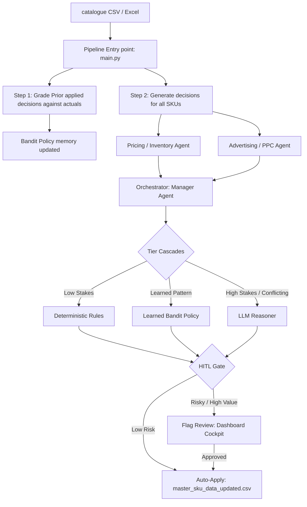
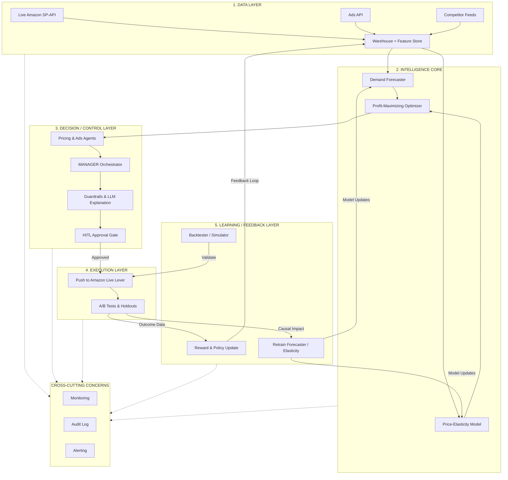

# Technical Brief: Multi-Agent Amazon Catalog Copilot

This document outlines the architecture, data structures, and operational flows of the autonomous Amazon catalog optimization platform. It describes the recently executed split-cockpit restructuring and provides guidelines for the engineering team, followed by a formal outline for a technical research paper.

---

## 1. System Architecture & Components

The codebase implements a closed-loop multi-agent P&L (Profit and Loss) owner system designed to optimize pricing and advertising bids dynamically across a product catalog.



### A. Subagents (`agents/`)
- **[inventory.py](file:///c:/Users/verel/Downloads/Amazon%20Agg/agents/inventory.py):** Analyzes margins, competitor prices, inventory health, and Buy Box win status. Recommends price movements (`RAISE_PRICE`, `DROP_PRICE`, etc.).
- **[advertising.py](file:///c:/Users/verel/Downloads/Amazon%20Agg/agents/advertising.py):** Analyzes click-through rates (CTR), conversion rates, organic sales shares, and advertising cost of sales (ACOS). Recommends bid adjustments (`INCREASE_BIDS`, `LOWER_BIDS`, etc.).
- **[manager.py](file:///c:/Users/verel/Downloads/Amazon%20Agg/agents/manager.py):** The orchestrator. Combines subagent recommendations using a hierarchical decision cascade to achieve the catalog's current business objective:
  1. *Rule-based Clamps (Tier 1):* Enforces hard limits (e.g., margins, stockout bounds).
  2. *Bandit Policy (Tier 2):* Consults policy values. Vetoes actions with negative tracking history.
  3. *LLM Cascade (Tier 3):* Calls the LLM on high-stakes, uncertain, or conflicting decisions.
- **[chatbot.py](file:///c:/Users/verel/Downloads/Amazon%20Agg/agents/chatbot.py):** Handles human prompts regarding decisions, catalog states, and bandit policy.

### B. Core Loop (`main.py`)
- **Grade Prior Run:** Matches previously applied decisions against newly imported CSV data to compute the reward (margins and penalization boundaries) and updates bandit weights.
- **Run Decision Cascade:** Executes agents over all SKUs.
- **Disk Writers:** Outputs the full [manager_decisions.csv](file:///c:/Users/verel/Downloads/Amazon%20Agg/manager_decisions.csv) and updates the master [master_sku_data_updated.csv](file:///c:/Users/verel/Downloads/Amazon%20Agg/master_sku_data_updated.csv).

### C. Persistent Memory & State (`utils/`)
- **[memory.py](file:///c:/Users/verel/Downloads/Amazon%20Agg/utils/memory.py):** Backed by [manager_memory.json](file:///c:/Users/verel/Downloads/Amazon%20Agg/manager_memory.json). Logs run statistics, pending review items, the contextual bandit policy table, and the prior decisions snapshot.
- **State Representation:** 
  - *Pricing Context:* Category × Supply status (critical, healthy, overstock) × Buy Box state (winning, losing).
  - *Advertising Context:* Category × PPC conversion state (no conversion, high acos, mid acos, low acos).

---

## 2. Recent Implementation Accomplishments

1. **State Restoration on Startup:** The UI loads `load_last_run_state()` immediately when first accessed. It deserializes [manager_decisions.csv](file:///c:/Users/verel/Downloads/Amazon%20Agg/manager_decisions.csv), matches it with the correct input file (`last_input_path`), and restores the metrics, data table, and charts.
2. **File Source Persistence:** The app retains the uploaded files selection (e.g. `uploaded_input.csv`) across tab reloads. It defaults to the uploaded files and displays active indicators.
3. **Decisions Sync to Disk:** Human approvals and rejections instantly write to the decisions CSV file.
4. **Reset Cleanup:** Restructured settings cleanup to completely wipe cache logs, uploaded files, memory keys, and decisions history.
5. **Split Cockpit Redesign:** Split the page into two panes (`col_dash, col_chat`) with independent scroll behavior:
   - **Left Panel (Dashboard):** Contains a new "Data Files & History" comparative ledger (comparing the active CSV against the baseline master Excel for Revenue, Price, and Spend), metrics, charts, tables, and the approvals queue.
   - **Right Panel (AI Copilot):** Features a scrollable chat interface, run summary cards, and quick suggestions.

---

## 3. Engineering Guidelines (Do's & Don'ts)

### Do:
- **Use the baseline check:** Always compare uploaded files to [master_sku_data.xlsx](file:///c:/Users/verel/Downloads/Amazon%20Agg/master_sku_data.xlsx) using the baseline check helper function.
- **Maintain JSON types:** Ensure dictionary outputs pass through validation (`pd.isna` check) before casting, avoiding float `nan` strings in text fields.
- **Preserve the feedback loop:** Remember that decisions must be marked `applied` and stored in memory's `last_decisions` snapshot so that tomorrow's execution can calculate reward delta.

### Don't:
- **Don't hardcode input filenames:** Always fetch input parameters from memory's `last_input_path` or local session configurations.
- **Don't bypass the human gate:** Flagged decisions should not be auto-applied to `master_sku_data_updated.csv`. They must wait for the human gate to approve.

---

## 4. Academic Research Paper Outline

You can feed this structure into an LLM to generate a full research paper draft.

```
TITLE: Coordinated Multi-Agent Catalog Optimization on Retail Marketplaces via Tiered Cascading Bandit-LLM Frameworks

ABSTRACT:
1-2 paragraphs detailing:
  - The problem of pricing and advertising allocation at scale on dynamic marketplaces.
  - The limitations of purely rule-based or purely LLM-based solutions (compute costs vs. heuristic rigidity).
  - Our approach: A cascading tiered agent framework that combines deterministic rules, contextual bandits, and LLM reasoners.
  - Results showing how we achieve robust margins, protect inventory levels, and optimize ad spend.

1. INTRODUCTION:
  - Background on retail marketplaces (Amazon Buy Box dynamics, PPC bidding structure).
  - Explaining the business objectives (profit maximization, stockout avoidance, organic rank preservation).
  - Contribution: The cascading agent architecture and human-in-the-loop validation framework.

2. SYSTEM ARCHITECTURE & CASCADE MECHANISM:
  - Definition of the subagents (Pricing, Advertising).
  - The Cascading Decision Orchestrator:
    * Tier 1: Vectorized Heuristic Rules (Safe Bounds).
    * Tier 2: Learned Policy Value Tables (Contextual Bandits).
    * Tier 3: LLM Reasoner (High economic exposure or agents conflict).
  - The Human-in-the-loop (HITL) gate for high-risk decisions.

3. CONTEXTUAL BANDIT POLICY LEARNING:
  - Formalizing the reinforcement learning state space (Days of Supply, Buy Box Status, ACOS bands).
  - Reward Shaping formulation: margin calculations adjusted by inventory stockout bounds and ACOS thresholds.
  - Policy updating rule: Running average updates per situation × action.

4. EXPERIMENTAL EVALUATION:
  - Setup: Baseline master SKU catalogue of 100 SKUs.
  - Iterative Runs: Transitioning through multiple Day-over-Day runs, showing the reward delta improvements.
  - Impact Analysis: Projections of profit increase, revenue, and average pricing movement.

5. DISCUSSION & RELATED WORK:
  - Comparison to traditional Q-learning, deep RL catalogs, and zero-shot LLM pricing.
  - Discussion on prompt optimization and guardrail clamps.

6. CONCLUSION & FUTURE DIRECTIONS:
  - Wrap-up of achievements.
  - Future expansion: Integrating real-world elasticity estimation and multi-catalogue sharing.
```

---

## 5. Future Architecture & Roadmap

The diagram below represents the proposed **Future Architecture**, mapping our current Multi-Agent Control system into a full closed-loop pipeline driven by a predictive Intelligence Core and A/B test validation layer




